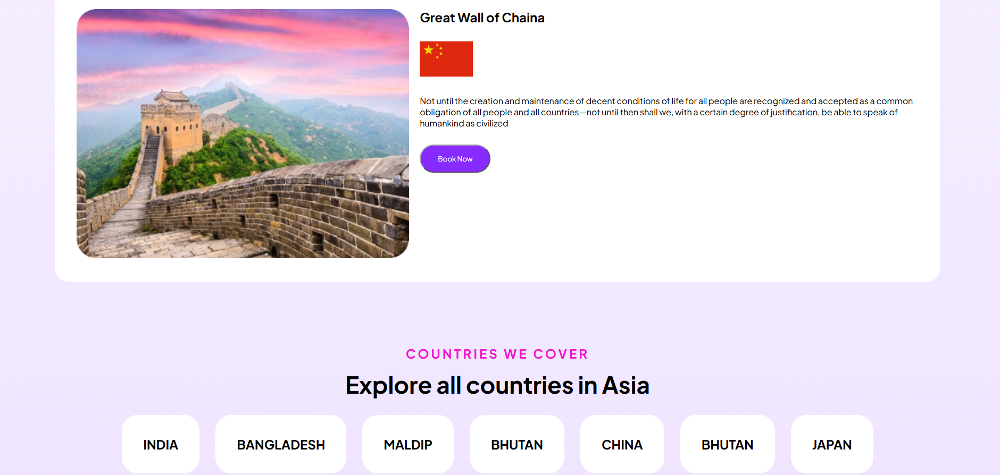

# 🌏 Tour Mama

**Tour Mama** is a simple and responsive travel website designed to help travelers explore popular destinations across Asia. The website presents travel services, popular destinations, covered countries, tourist reviews, and booking-related sections in a clean and user-friendly interface.

## ✨ Features

* 🌏 Explore popular destinations in Asia
* 🧳 Travel services section
* 🏯 Featured destination section
* 🌍 Countries covered across Asia
* ⭐ Tourist reviews and experiences
* 🎬 Watch Demo and Get Started buttons
* 📱 Responsive design for different screen sizes
* 🎨 Clean and modern travel-focused UI
* 🔐 Secure Payment and Flexible Booking information

## 🛠️ Technologies Used

* **HTML5** — Website structure
* **CSS3** — Styling and layout
* **Google Fonts** — Plus Jakarta Sans
* **Responsive CSS** — Mobile and tablet responsiveness
* **Git & GitHub** — Version control and project hosting


## 🏠 Website Sections

### 1. Hero Section

The hero section introduces Tour Mama with the message:

> **From Southeast Asia to the World.**

It also provides:

* Get Started button
* Watch Demo button
* Travel-related hero image

### 2. Services

The services section explains why travelers can use Tour Mama.

It includes:

* **All Your Needs**
* **Flexible Booking**
* **Secure Payment**

### 3. Best of Asia

This section highlights popular Asian destinations.

Currently, it features:

* **Great Wall of China**

Travelers can learn about the destination and use the **Book Now** button.

### 4. Countries We Cover

Tour Mama highlights several Asian countries, including:

* India
* Bangladesh
* Maldives
* Bhutan
* China
* Japan

### 5. Tourist Reviews

The review section displays experiences from travelers who have used the service.

It includes:

* Traveler feedback
* Traveler information
* Star rating image

### 6. Footer

The footer contains:

* Copyright information
* Facebook icon
* Instagram icon
* YouTube icon

## 🚀 How to Run Locally

No additional installation is required because this project uses HTML and CSS.

### 1. Clone the repository

```bash
git clone https://github.com/Wasima230Sultana/Tour-Mama.git
```

### 2. Open the project

```bash
cd Tour-Mama
```

### 3. Run the website

You can simply open:

```text
index.html
```

in your browser.

Alternatively, if use **VS Code**, install the **Live Server** extension and open the project with Live Server.

## 📸 Website Preview

```markdown

```

## 🎯 Project Purpose

The main purpose of this project is to practice and demonstrate:

* Semantic HTML
* CSS layouts
* Flexbox and Grid
* Responsive web design
* Website section organization
* Image handling
* Git and GitHub workflow
* Building a travel-themed landing page

## 🔮 Future Improvements

Some features that can be added in the future:

* [ ] Navigation bar
* [ ] Functional booking system
* [ ] Destination search
* [ ] Destination details pages
* [ ] User authentication
* [ ] Online payment integration
* [ ] Dynamic tourist reviews
* [ ] More Asian destinations
* [ ] Mobile navigation menu
* [ ] Dark mode
* [ ] Backend/API integration

## 👨‍💻 Author

**Wasima Sultana**

Computer Science & Engineering Student
Metropolitan University, Bangladesh

## 📄 License

This project is created for educational and portfolio purposes.
